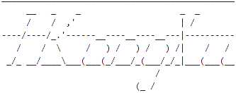
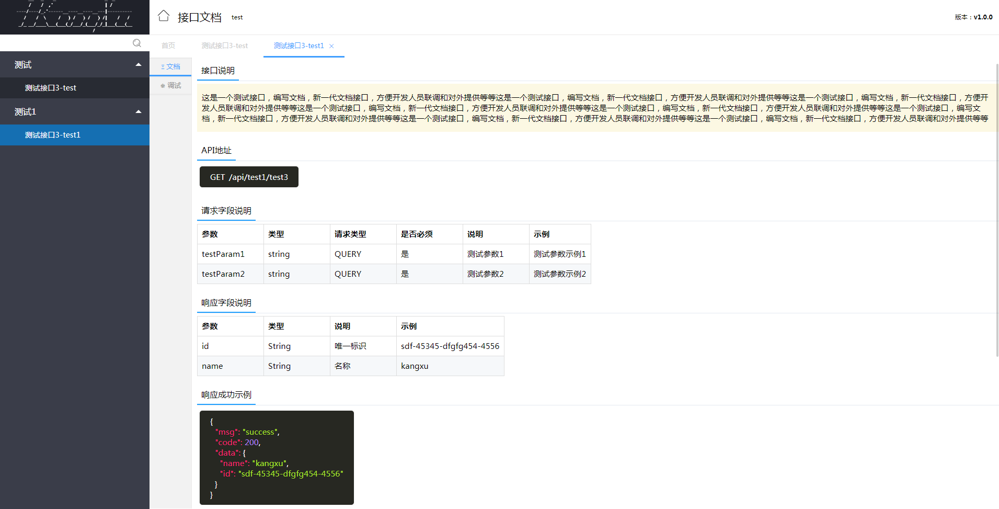
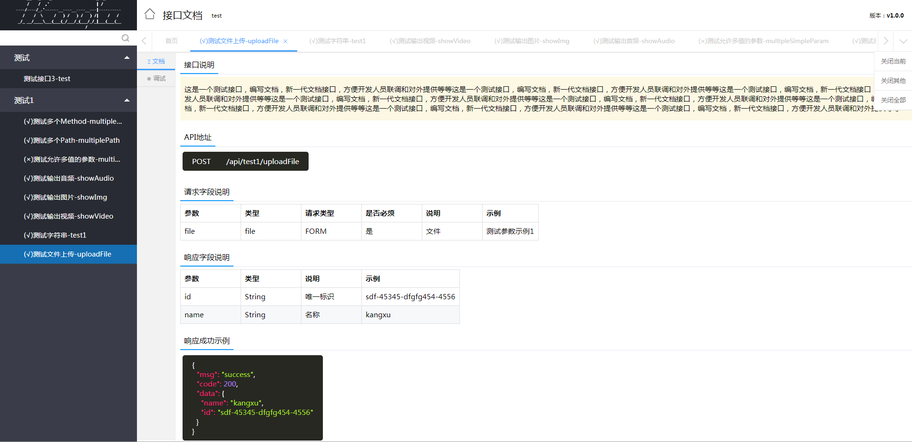
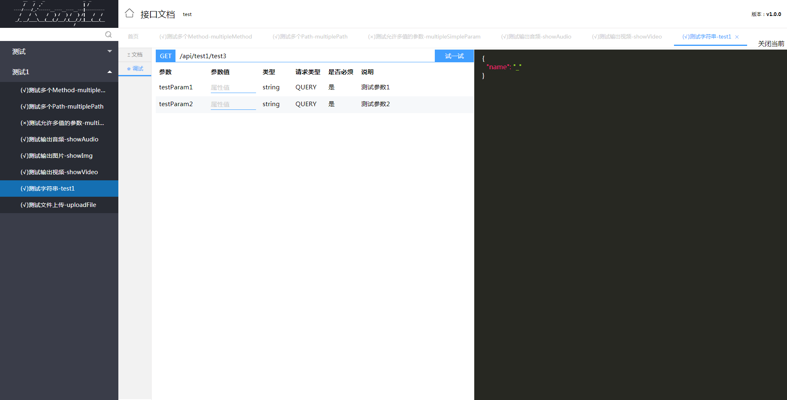

### 介绍

由于现在现有的JavaDoc不太满足个人使用需求，所以重新构建了一套在线文档依赖，现在个人使用最多的在线文档是Swagger-ui，由于界面和操作不太符合个人习惯，即将被本人废弃不用啦，接下来的程序基本都会使用这套文档生成方式，本文档更适合程序猿的操作习惯

### 调用方式

```yaml
    cn:
      ikangxu:
        doc:
          global:
            enabled: true
            doamin: http://apidoc.ikangxu.cn/
          response:
            success:
              template: {"code":200,"msg":"success","data":{{DATA}}}
              type: json
            fail:
              template: failure
              type: text         
```

上面的参数配置，是文档默认的参数值，如果需要自定义，修改即可。

在配置类上添加注解`@EnableDoc`

```java
    @Autowired
    private List<RequestHandler> requestHandlers;

    @Bean
    @Order(1)
    public Docket createDoc() {

        Predicate<RequestHandler> predicate = new Predicate<RequestHandler>() {
            @Override
            public boolean apply(RequestHandler input) {
                Class<?> declaringClass = input.declaringClass();
                // 被注解的类
                if (declaringClass.isAnnotationPresent(RestController.class)
                        || declaringClass.isAnnotationPresent(Controller.class)) {

                    // 被注解的方法
                    if (input.isAnnotatedWith(GetMapping.class) || input.isAnnotatedWith(PostMapping.class)
                            || input.isAnnotatedWith(RequestMapping.class)
                            || declaringClass.isAnnotationPresent(ApiIgnore.class))
                        return true;
                }
                return false;
            }
        };

        List<RequestHandler> newArrayList = Lists.newArrayList(Iterables.filter(requestHandlers, predicate));

        return Docket.builder().docInfo(DocInfo.builder().title("test").description("描述").version("v1.0.0").build()).apis(newArrayList).isDebuger(true).enabled(true).groupName("test").build();
    }
```

配置一切准备就绪之后，我们来构造一些RestApi接口，如下：
```java
    @ApiMethod(
            name = "测试接口3-test1",
            method = HttpMethod.GET,
            response = TestEntity.class,
            produces = MediaType.APPLICATION_JSON_UTF8_VALUE,
            description = "这是一个测试接口，编写文档，新一代文档接口，方便开发人员联调和对外提供等等这是一个测试接口，编写文档，新一代文档接口，方便开发人员联调和对外提供等等这是一个测试接口，编写文档，新一代文档接口，方便开发人员联调和对外提供等等这是一个测试接口，编写文档，新一代文档接口，方便开发人员联调和对外提供等等这是一个测试接口，编写文档，新一代文档接口，方便开发人员联调和对外提供等等这是一个测试接口，编写文档，新一代文档接口，方便开发人员联调和对外提供等等这是一个测试接口，编写文档，新一代文档接口，方便开发人员联调和对外提供等等这是一个测试接口，编写文档，新一代文档接口，方便开发人员联调和对外提供等等",
            discarded = false
    )
    @ApiParams({
            @ApiParam(name = "testParam1", description = "测试参数1", paramType = ParamType.QUERY, dataType = "string", required = true, allowMultiple = false, example = "测试参数示例1"),
            @ApiParam(name = "testParam2", description = "测试参数2", paramType = ParamType.QUERY, dataType = "string", required = true, allowMultiple = false, example = "测试参数示例2")
    })
    @ApiResponses({
            @ApiResponse(code = 200, msg = "成功", description = ""),
            @ApiResponse(code = 500, msg = "错误", description = "")
    })
    @GetMapping(value = "test3", produces = MediaType.APPLICATION_JSON_UTF8_VALUE)
    public String test1(String testParam1, String testParam2) {
        return "test3";
    }
```

我们将程序运行起来，在浏览器中访问`http://127.0.0.1:8080/api-ui.html`

### 部分页面截图





